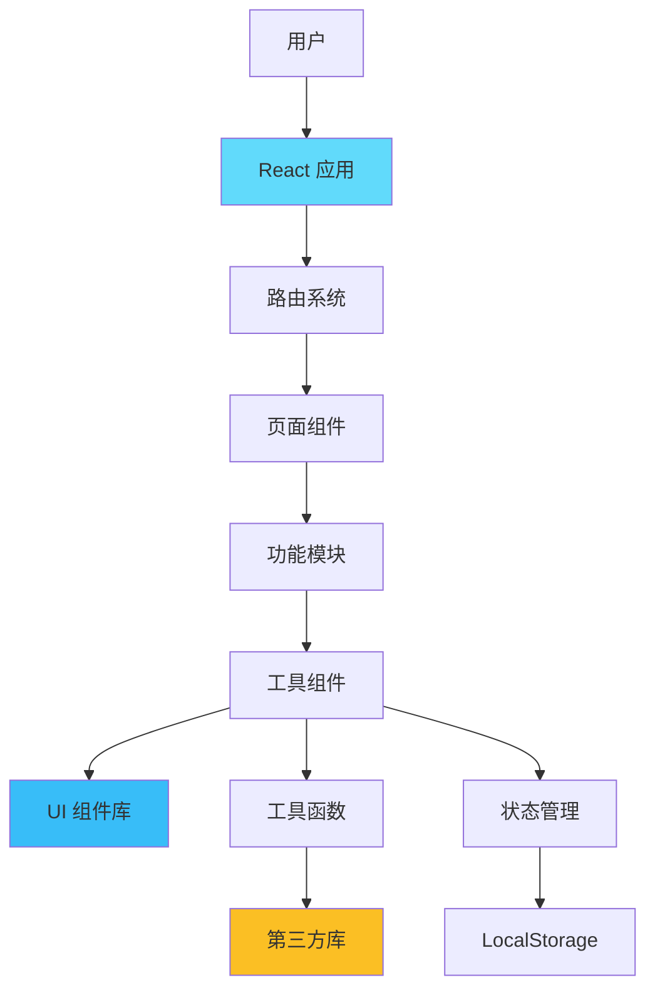
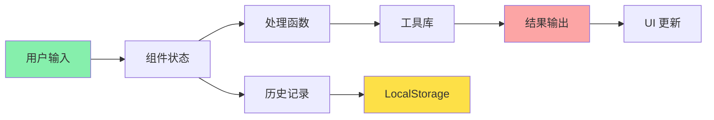

# 前端工具集项目架构设计

## 项目概述

这是一个基于 React + TypeScript + Vite 的现代化前端工具集应用，提供各种开发者常用的工具，如加密解密、JSON 处理、时间戳转换等。

## 技术栈

### 核心技术
- **React 18+**: 用户界面库
- **TypeScript**: 类型安全的 JavaScript 超集
- **Vite**: 下一代前端构建工具
- **React Router**: 客户端路由管理

### UI 框架
- **shadcn/ui**: 基于 Radix UI 的可定制组件库
- **Tailwind CSS**: 实用优先的 CSS 框架
- **Lucide React**: 现代化图标库

### 工具库
- **crypto-js**: 加密算法实现
- **date-fns**: 日期时间处理
- **zustand**: 轻量级状态管理
- **react-hot-toast**: 通知提示组件

## 项目结构

```
tool-ui/
├── public/                 # 静态资源
│   └── favicon.ico
├── src/
│   ├── assets/            # 资源文件
│   │   └── images/
│   ├── components/        # 可复用组件
│   │   ├── ui/           # shadcn/ui 组件
│   │   ├── layout/       # 布局组件
│   │   │   ├── Header.tsx
│   │   │   ├── Sidebar.tsx
│   │   │   └── Footer.tsx
│   │   └── common/       # 通用组件
│   │       ├── CopyButton.tsx
│   │       ├── ThemeToggle.tsx
│   │       └── ToolCard.tsx
│   ├── features/          # 功能模块（按工具分类）
│   │   ├── crypto/       # 加密解密工具
│   │   │   ├── components/
│   │   │   │   ├── AESCrypto.tsx
│   │   │   │   ├── RSACrypto.tsx
│   │   │   │   └── HashGenerator.tsx
│   │   │   ├── hooks/
│   │   │   │   └── useCrypto.ts
│   │   │   └── utils/
│   │   │       └── cryptoHelpers.ts
│   │   ├── json/         # JSON 工具
│   │   │   ├── components/
│   │   │   │   ├── JsonFormatter.tsx
│   │   │   │   ├── JsonCompressor.tsx
│   │   │   │   └── JsonEscape.tsx
│   │   │   └── utils/
│   │   │       └── jsonHelpers.ts
│   │   ├── timestamp/    # 时间戳工具
│   │   │   ├── components/
│   │   │   │   └── TimestampConverter.tsx
│   │   │   └── utils/
│   │   │       └── timeHelpers.ts
│   │   ├── base64/       # Base64 工具
│   │   │   └── components/
│   │   │       └── Base64Converter.tsx
│   │   ├── url/          # URL 工具
│   │   │   └── components/
│   │   │       └── UrlEncoder.tsx
│   │   ├── color/        # 颜色转换工具
│   │   │   └── components/
│   │   │       └── ColorConverter.tsx
│   │   └── regex/        # 正则表达式工具
│   │       └── components/
│   │           └── RegexTester.tsx
│   ├── hooks/            # 全局自定义 Hooks
│   │   ├── useClipboard.ts
│   │   ├── useLocalStorage.ts
│   │   └── useTheme.ts
│   ├── lib/              # 工具函数库
│   │   └── utils.ts
│   ├── pages/            # 页面组件
│   │   ├── Home.tsx
│   │   ├── CryptoPage.tsx
│   │   ├── JsonPage.tsx
│   │   ├── TimestampPage.tsx
│   │   └── NotFound.tsx
│   ├── store/            # 状态管理
│   │   ├── useThemeStore.ts
│   │   └── useHistoryStore.ts
│   ├── styles/           # 全局样式
│   │   └── globals.css
│   ├── types/            # TypeScript 类型定义
│   │   └── index.ts
│   ├── App.tsx           # 根组件
│   ├── main.tsx          # 应用入口
│   └── router.tsx        # 路由配置
├── .eslintrc.cjs         # ESLint 配置
├── .prettierrc           # Prettier 配置
├── components.json       # shadcn/ui 配置
├── index.html            # HTML 模板
├── package.json          # 项目依赖
├── postcss.config.js     # PostCSS 配置
├── tailwind.config.js    # Tailwind CSS 配置
├── tsconfig.json         # TypeScript 配置
├── tsconfig.node.json    # Node TypeScript 配置
└── vite.config.ts        # Vite 配置
```

## 核心功能模块

### 1. 加密解密工具 (Crypto)

**功能列表:**
- AES 加密/解密（支持多种模式：CBC, ECB, CTR 等）
- RSA 加密/解密（支持公钥/私钥生成）
- DES/3DES 加密/解密
- 哈希生成（MD5, SHA-1, SHA-256, SHA-512）
- HMAC 生成
- 密钥生成器

**技术实现:**
- 使用 `crypto-js` 库实现对称加密
- 使用 `node-forge` 或 `jsencrypt` 实现 RSA 非对称加密
- 提供密钥强度验证
- 支持多种编码格式（Base64, Hex）

### 2. JSON 工具 (JSON)

**功能列表:**
- JSON 格式化（美化）
- JSON 压缩（最小化）
- JSON 转义/去转义
- JSON 验证
- JSON 转 YAML/XML
- JSON 路径查询

**技术实现:**
- 原生 `JSON.parse()` 和 `JSON.stringify()`
- 语法高亮显示
- 错误提示和行号定位

### 3. 时间戳工具 (Timestamp)

**功能列表:**
- 时间戳转日期时间
- 日期时间转时间戳
- 支持多种时间戳格式（秒、毫秒、微秒）
- 时区转换
- 相对时间计算
- 批量转换

**技术实现:**
- 使用 `date-fns` 进行日期处理
- 支持多种日期格式
- 实时时间显示

### 4. Base64 工具

**功能列表:**
- 文本 Base64 编码/解码
- 图片 Base64 编码/解码
- 文件 Base64 编码
- URL Safe Base64

### 5. URL 工具

**功能列表:**
- URL 编码/解码
- URL 参数解析
- URL 构建器
- Query String 转 JSON

### 6. 颜色转换工具

**功能列表:**
- HEX ↔ RGB 转换
- RGB ↔ HSL 转换
- 颜色预览
- 颜色选择器
- 渐变色生成

### 7. 正则表达式测试工具

**功能列表:**
- 正则表达式匹配测试
- 匹配结果高亮
- 常用正则表达式模板
- 正则表达式解释
- 替换功能

## 设计模式

### 1. 组件设计原则

- **单一职责**: 每个组件只负责一个功能
- **可复用性**: 提取通用组件到 `components/common`
- **可组合性**: 使用组合而非继承
- **类型安全**: 所有组件都有完整的 TypeScript 类型定义

### 2. 状态管理策略

```typescript
// 使用 Zustand 进行轻量级状态管理
interface ThemeStore {
  theme: 'light' | 'dark';
  toggleTheme: () => void;
}

interface HistoryStore {
  history: HistoryItem[];
  addHistory: (item: HistoryItem) => void;
  clearHistory: () => void;
}
```

### 3. 路由设计

```typescript
const routes = [
  { path: '/', element: <Home /> },
  { path: '/crypto', element: <CryptoPage /> },
  { path: '/json', element: <JsonPage /> },
  { path: '/timestamp', element: <TimestampPage /> },
  { path: '/base64', element: <Base64Page /> },
  { path: '/url', element: <UrlPage /> },
  { path: '/color', element: <ColorPage /> },
  { path: '/regex', element: <RegexPage /> },
  { path: '*', element: <NotFound /> }
];
```

## UI/UX 设计

### 1. 布局结构

```
┌─────────────────────────────────────────┐
│           Header (导航栏)                │
├──────────┬──────────────────────────────┤
│          │                              │
│ Sidebar  │      Main Content            │
│ (工具列表)│      (工具界面)               │
│          │                              │
│          │                              │
└──────────┴──────────────────────────────┘
```

### 2. 主题系统

- **明亮主题**: 白色背景，深色文字
- **暗黑主题**: 深色背景，浅色文字
- 使用 CSS 变量实现主题切换
- 主题偏好保存到 localStorage

### 3. 响应式设计

- **桌面端** (≥1024px): 侧边栏 + 主内容区
- **平板端** (768px-1023px): 可折叠侧边栏
- **移动端** (<768px): 底部导航栏

### 4. 交互设计

- 输入实时验证
- 操作结果即时反馈
- 一键复制功能
- 历史记录保存
- 快捷键支持

## 性能优化

### 1. 代码分割

```typescript
// 路由级别的代码分割
const CryptoPage = lazy(() => import('./pages/CryptoPage'));
const JsonPage = lazy(() => import('./pages/JsonPage'));
```

### 2. 组件懒加载

- 使用 `React.lazy()` 和 `Suspense`
- 路由级别的代码分割
- 按需加载工具模块

### 3. 性能监控

- 使用 React DevTools Profiler
- 监控组件渲染性能
- 优化大数据处理

### 4. 缓存策略

- LocalStorage 缓存用户设置
- SessionStorage 缓存临时数据
- 使用 Service Worker 实现离线访问

## 安全考虑

1. **输入验证**: 所有用户输入都需要验证
2. **XSS 防护**: 使用 React 的自动转义
3. **敏感数据**: 加密数据不存储在浏览器
4. **HTTPS**: 生产环境强制使用 HTTPS
5. **CSP**: 配置内容安全策略

## 测试策略

### 1. 单元测试
- 使用 Vitest 进行单元测试
- 测试工具函数和 Hooks
- 目标覆盖率: 80%+

### 2. 组件测试
- 使用 React Testing Library
- 测试组件交互和渲染

### 3. E2E 测试
- 使用 Playwright 或 Cypress
- 测试关键用户流程

## 部署方案

### 1. 静态部署
- **Vercel**: 推荐，零配置部署
- **Netlify**: 支持持续部署
- **GitHub Pages**: 免费托管

### 2. Docker 部署
```dockerfile
FROM node:18-alpine as builder
WORKDIR /app
COPY package*.json ./
RUN npm ci
COPY . .
RUN npm run build

FROM nginx:alpine
COPY --from=builder /app/dist /usr/share/nginx/html
EXPOSE 80
CMD ["nginx", "-g", "daemon off;"]
```

### 3. CDN 加速
- 静态资源上传到 CDN
- 配置缓存策略
- 启用 Gzip/Brotli 压缩

## 开发规范

### 1. 代码规范
- 使用 ESLint 进行代码检查
- 使用 Prettier 进行代码格式化
- 遵循 Airbnb React 代码规范

### 2. Git 工作流
- 使用 Conventional Commits 规范
- 功能分支开发
- Pull Request 代码审查

### 3. 命名规范
- 组件: PascalCase (例: `CryptoTool.tsx`)
- 函数: camelCase (例: `handleEncrypt`)
- 常量: UPPER_SNAKE_CASE (例: `MAX_FILE_SIZE`)
- 类型: PascalCase (例: `CryptoConfig`)

## 扩展性设计

### 1. 插件系统
- 支持动态加载工具模块
- 提供工具注册机制
- 支持第三方工具集成

### 2. 国际化
- 使用 i18next 实现多语言
- 支持中文、英文
- 可扩展其他语言

### 3. 自定义主题
- 支持自定义颜色方案
- 支持导入/导出主题配置

## 系统架构图



## 数据流图



## 总结

这个架构设计遵循了现代前端开发的最佳实践，具有以下特点：

1. **模块化**: 清晰的目录结构和功能划分
2. **可维护性**: 使用 TypeScript 和严格的代码规范
3. **可扩展性**: 插件化设计，易于添加新工具
4. **性能优化**: 代码分割、懒加载、缓存策略
5. **用户体验**: 响应式设计、主题切换、快捷操作
6. **安全性**: 输入验证、XSS 防护、HTTPS
7. **可测试性**: 完善的测试策略和工具

这个架构为项目的长期发展提供了坚实的基础。